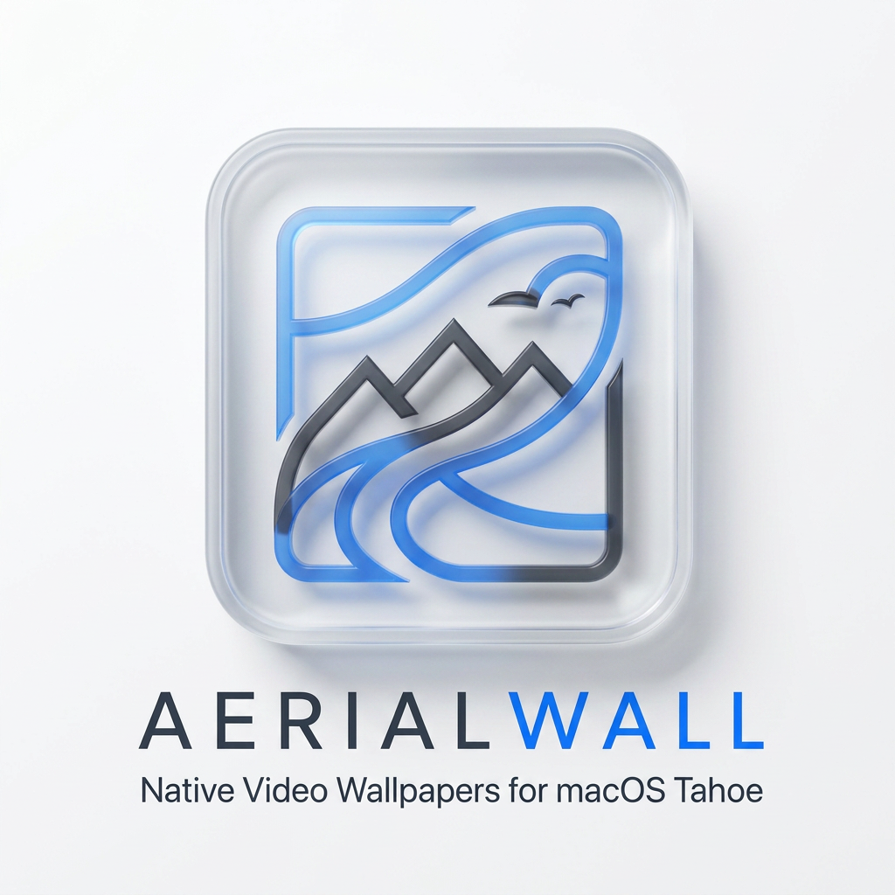

<div align="center">
  

  # AerialWall

  **Native video wallpapers for macOS Tahoe.**  
  Import any video. It shows up in System Settings — just like Apple's own aerials.

  [](https://github.com/CatKinKitKat/AerialWall/releases)
  [](https://www.apple.com/macos/)
  [](LICENSE)
</div>

---

## What it does

AerialWall transcodes your video into the exact HEVC format macOS expects, injects it into the wallpaper manifest, and adds it as a native **AerialWall** category in System Settings → Wallpaper. No overlays. No fake windows. No custom renderers — your wallpaper plays through the same `WallpaperAerialsExtension` that Apple's own aerials use.

## Features

- **Native integration** — appears in System Settings → Wallpaper alongside Apple's landscapes
- **Lock screen + desktop** — works on both, survives lock/unlock cycle
- **Tahoe-native** — built around macOS 26's JSON manifest architecture (`entries.json`)
- **Hardware-accelerated** — VideoToolbox HEVC with 2-layer temporal hierarchy (required by `WallpaperAerialsExtension`)
- **Non-destructive** — full backup of `entries.json` before every change, atomic writes throughout
- **Open source** — MIT, no telemetry, no subscription

## Requirements

- **macOS 26 (Tahoe) ≥ 26.4**
- **Non-sandboxed** — needs access to `~/Library/Application Support/com.apple.wallpaper`

## Installation

> DMG packaging coming in the next milestone (T16).

Build from source:

```bash
git clone https://github.com/CatKinKitKat/AerialWall
cd AerialWall
swift run AerialWall
```

## Supported formats

| Format | Notes |
|--------|-------|
| `.mp4`, `.mov`, `.m4v` | Direct import |
| `.webm`, `.mkv`, `.avi` | Convert to `.mp4` first (HandBrake) |

## How it works

1. You pick a video in the import sheet (name + description)
2. AerialWall transcodes it to HEVC Main 10 with the right 2-layer temporal structure
3. The result lands in `~/Library/Application Support/com.apple.wallpaper/aerials/`
4. Your video appears in the **AerialWall** category in System Settings → Wallpaper
5. A persistence watcher re-injects entries if macOS ever resets the manifest

See [`SPEC.md`](SPEC.md) for the full reverse-engineering notes and invariants.

## Contributing

See [`CONTRIBUTING.md`](CONTRIBUTING.md) for the branch model and spec-driven development workflow.

## License

[AGPL-3.0](LICENSE)
